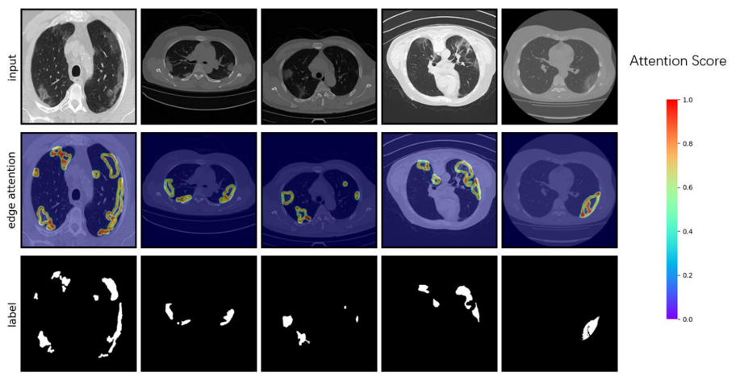

# EF-Net-covid-19-lesion-segmentation

## Network contains Edge Parallel-Dual Attention Guide and Feature Filtering Module (EF-Net)
A model for segmentation of covid 19 lesion from lung CT.
EF-Net offers better, clearer segmentation results, particularly in segmenting lesion edges.

## Authors
Wenjin Zhong※, The University of New South Wales.<br>
HanWen Zhang, The University of New South Wales.<br>

```markdown
## Modules
- Edge Dual-Parallel Attention
- Feature Filter Fusion Module
- Deep-level Feature Aggregator
```
Code is comging soon

Here is the output of our Edge Dual-Parallel Attention
<p align="center">
  
</p>

Here is the heapmap that model focus on 
<p align="center">
  
</p>

Here is the final output comparing existing models
<p align="center">
  
</p>
